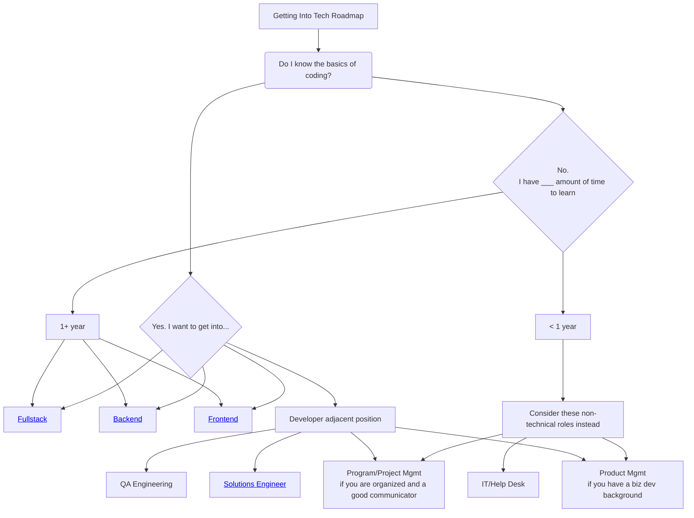

# Resources

This repository contains helpful links, tips, and other various resources. If you have no idea where to start and you're very early in your journey, I recommend taking a look at https://roadmap.sh/ to get a feel for the technology you should be looking at.

## Breaking Into Tech Roadmap

This is a general roadmap for folks considering various careers in tech.

## Good To Know Regardless of What Path You Choose

In any coding or technology related role, knowing these skills will only benefit you. You should feel comfortable with these skills prior to even considering applying for work:
- html/css
- git / version control
- javascript (if frontend or fullstack)
- OR a different language (i.e. Python, Java, Golang)
- Relational databases (MySQL/Postgres are good starters)
- SQL (for interacting with your database)

## Design Patterns

- https://www.patterns.dev/
- https://refactoring.guru/design-patterns

## Good engineering blogs to subscribe to
Quastor - Aggregation & summaries of top engineering blogs - https://blog.quastor.org/ 
Spotify Engineering - https://engineering.atspotify.com/ 
Atlassian Developers - https://blog.developer.atlassian.com/ 
Airbnb Tech Blog - https://medium.com/airbnb-engineering 
AWS Blog - https://aws.amazon.com/blogs/aws/ 
Meta Engineering -  https://www.facebook.com/Engineering 
Google Research - https://blog.research.google/ 
LinkedIn Engineering - https://engineering.linkedin.com/blog
Microsoft Engineering - https://techcommunity.microsoft.com/t5/microsoft-learn-blog/bg-p/MicrosoftLearnBlog 
Netflix Tech Blog - https://netflixtechblog.com/ 
PayPal Technology Blog - https://medium.com/paypal-tech 
Slack Engineering - https://slack.engineering/
Twitter X Engineering - https://blog.twitter.com/engineering/en_us 
Uber Engineering - https://www.uber.com/en-DE/blog/engineering/ 

## Miscellaneous Reading

Understanding retries - https://encore.dev/blog/retries
Path to Senior Engineer Handbook - https://github.com/jordan-cutler/path-to-senior-engineer-handbook 

